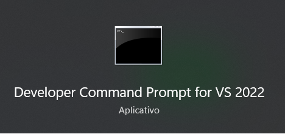
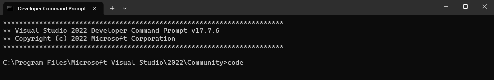
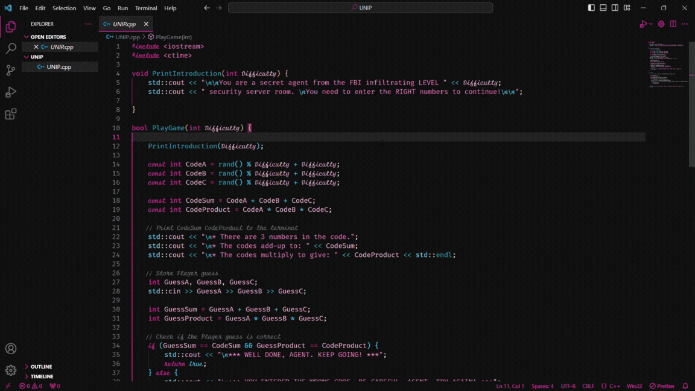

# Undercover Numbers: Infiltration Protocol (UNIP)
### How the game works

## Initializing the Game

Open Visual Studio Code from Developer Command Prompt 
  

Type code at terminal Developer Command Prompt
  

   
  

    

